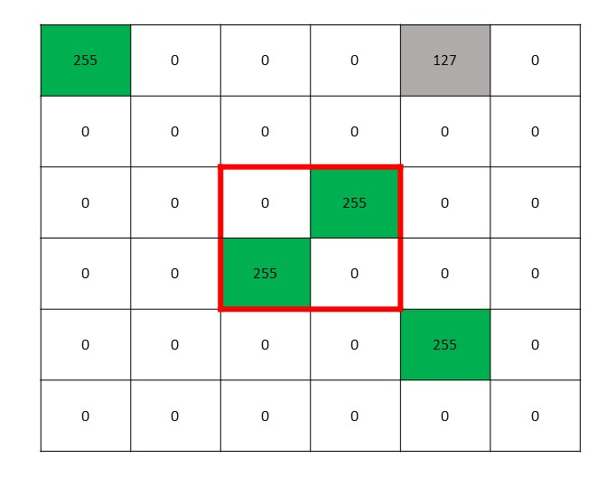
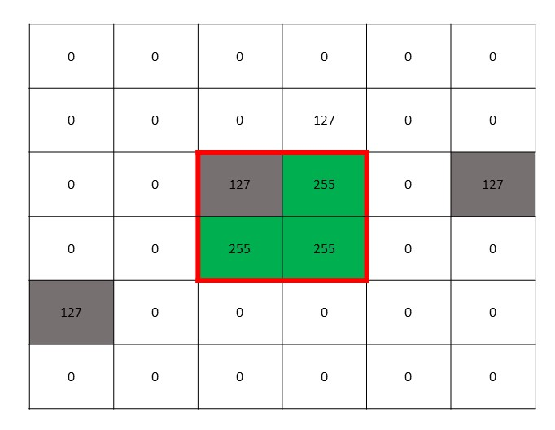

## Map Filter

Nihal Solomon Soans

nihalsoans91@uga.edu

We solve the problem of removing obstabe noise using a filter of size 41 x 41 as askedin the problem statement. As shown in Figure 2 and 3 overthe whole image. This filter slides along the image similar tohow a convolution Neural Network works. The filter checksif there is any cluster of objects near it if there is it discard thethat iteration of the filter and moves to the next one. Figure2 will help understand this problem. All cells in Figure 1 and 2 colored in green are obstacles and white are empty and onescolored in grey are unexplored. In our experiment we use a 41 by 41 filter size but for simplicity we use a filter of size 6by 6.

Figure 1: Filter values that are got from the image which does not satisfy the two conditions

The filter has an area called the target area this is shown in the red border in Figure 2 and Figure 3 this area is the wherethe detection occurs. If there is no object in this area that is ifthe value is either 0 or 127 then the current area of interest is discarded and the next one is taken. This is done to preventunwanted resource utilization. Doing so helps us move tonext one without wasting resources. The target area can be changed as per the users choice. Increasing this value will get better accuracy but will take a hit on resources. Upon trying multiple sizes of target area we recommend the size of 2 by 2.

Once a pixel of number 255 or an object is discovered inthis target area. we then check all the values in the surround-ing filter if there is a object or value 255 current filter is dis-carded. Figure 2 shows a good example where the filter val-ues are discarded and the next one is taken. There are 255 inthe the target area and then there are multiple 255 around itthis hows. It figures out if there is a object close to it

Figure 2: Filter values that are got from the image which satisfies the two conditions

